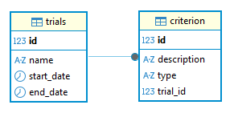

# POC Database Entity Framework

## Tech Stack

- Entity Framework
- PostgreSql
- .NET 6

## Conventions

### PostgreSql

> Case Sensitivity 

New for me: everything in lowercase unless you want to wrap double quotes around everything.

```sql
SELECT  *
FROM    "MyTableName"

SELECT 	id
		, description
		, type
		, trial_id
FROM    criterion;
```

> String Qualifier - Double quotes for, not []

- MS SQL: []
- Pg SQL: ""

```sql

SELECT 	id
		, "description"
		, "type"
		, trial_id
FROM    criterion;
```

### MySql

> Case Sensitivity

You can use whatever case you want.

```sql
SELECT 	Id 
		, `Name` 
		, StartDate 
		, EndDate
FROM 	Trials
```

> String Qualifier - `MyString` for, not []

- MS SQL: []
- My SQL: ``

## Getting Started

This solution requires access to two database server types:

- MySql
- PostgreSql

I'm using Docker to host both servers. Connection strings are in the codebase in plain text, local connections only.

Please ensure both servers are available and work with the specified connection strings or update to what works for you.

Connection strings are stored:

- POC.Harness\Program.cs
- POC.Entities\DbContexts\OptimiserMySqlDbContextFactory.cs
- POC.Entities\DbContexts\OptimiserPgDbContextFactory.cs

You will need .NET's EF CLI 7.2 or higher installed and run EF CLI commands:

```bash
# install if not already installed 
dotnet tool install --global dotnet-ef --version 7.0.11

# Create the database and schema
dotnet ef database update --context OptimiserPgSqlDbContext
dotnet ef database update --context OptimiserMySqlDbContext
```

Highly recommend you install https://dbeaver.io/ to read both database schemas.

## EF CLI Commands

In Terminal, PowerShell cd into: {your-directory}/poc-database-entity-framework/POC.Entities/

```bash
dotnet ef migrations add Init --context OptimiserPgSqlDbContext --output-dir Migrations/PgSql

dotnet ef migrations add Init --context OptimiserMySqlDbContext --output-dir Migrations/MySql

# Add the database and schema based on the connection string in /POC.Entities\DbContexts\OptimiserPgDbContextFactory.cs
dotnet ef database update --context OptimiserPgSqlDbContext
dotnet ef database update --context OptimiserMySqlDbContext
```



1. a trial can have 0, 1 or many criteria
2. a criteria must have 1 trial
3. criteria must be unique by { trial_id, type }

## Entity Framework Strategies

In this strategy we will be focusing on Entity Framework and the databases Sanro is working with: MySql and PostgreSql.

With Entity Framework and other Object Relational Mapping (ORM) frameworks there a a couple of common concepts:

- Entity (MyTable) - the model that represents the database table (MyTable) in code
- Constraints
	- datatype
	- required
	- nullable 
	- and more
- FluentApi

You can apply these constraints via data annotations, FluentAPI or both however, some constraints are not available as data annotations.

**The Strategy:**

> Entity

The entity (MyTable) is static and will reflect the table called MyTable in the database. This table will have columns called Col1, Col2 and more however, the entity should be compatible across database tech stacks: MySql, PostgreSql, MS Sql, ... so it is important to not be too opinionated at this level.

> FluentAPI (class the inherits DbContext)

**OnModelCreating:** is the right place for Database-Specific constraints
OnModelCreating (inside the class that inherits DbContext) is where EF Core's Fluent API lives. Because it is configured per-context, it is naturally scoped to a specific database provider — MySQL, PostgreSQL, SQL Server, etc.

This makes it the ideal place to define the majority of your table and column constraints, since you can tailor the configuration precisely to what your target database supports.

> Bonus — Cross-Provider Portability via Data Annotations

EF Core also supports a degree of provider-agnostic mapping through data annotations, which it translates automatically based on whichever provider package is installed.

Take EntityBase as an example:

```c#
public abstract class EntityBase : IEntity
{
    [Key]
    [DatabaseGenerated(DatabaseGeneratedOption.Identity)]
    [Column("id")]
    public int Id { get; set; }
}
```
The annotations [Key] and [DatabaseGenerated(DatabaseGeneratedOption.Identity)] carry no provider-specific meaning on their own. EF Core delegates the translation to the active provider package:

| Provider | Package | Generate SQL |
|-|-|-|
| PostgreSQL | Npgsql.EntityFrameworkCore.PostgreSQL | SERIAL / GENERATED BY DEFAULT AS IDENTITY |
| MySQL | Pomelo.EntityFrameworkCore.MySql | INT AUTO_INCREMENT |

In this project both the MySQL and PostgreSQL contexts have their own concrete OnModelCreating implementations to handle anything the annotation layer cannot express — such as provider-specific enum types, index naming conventions, or custom column types. The data annotation on EntityBase.Id covers the common case; the Fluent API fills in the gaps.

##  EF Query Translations

The most common question I hear when I talk about Entity Framework is: 

*That's great but it would be interesting to see the SQL translation.*

Well, here it is:

Same LINQ query syntax across both database providers:
```c#
return await _context.Trials
    .Include(p => p.Criterion)
    .ToListAsync();
```

SQL generated by entity framework version 7.0.11 generates the same query, with the exception of the case on table and column names, Oh and MySql qualifies all items with ``:
```sql
--  PostgreSql
SELECT 	t.id, t.end_date, t.name, t.start_date, c.id, c.description, c.trial_id, c.type
FROM 	trials AS t
      	LEFT JOIN criterias AS c 
			ON t.id = c.trial_id
ORDER BY t.id

--  MySql
SELECT `t`.`Id`, `t`.`EndDate`, `t`.`Name`, `t`.`StartDate`, `c`.`id`, `c`.`Description`, `c`.`TrialId`, `c`.`Type`
FROM 	`Trials` AS `t`
      	LEFT JOIN `Criterion` AS `c`
			ON `t`.`Id` = `c`.`TrialId`
ORDER BY `t`.`Id`
```